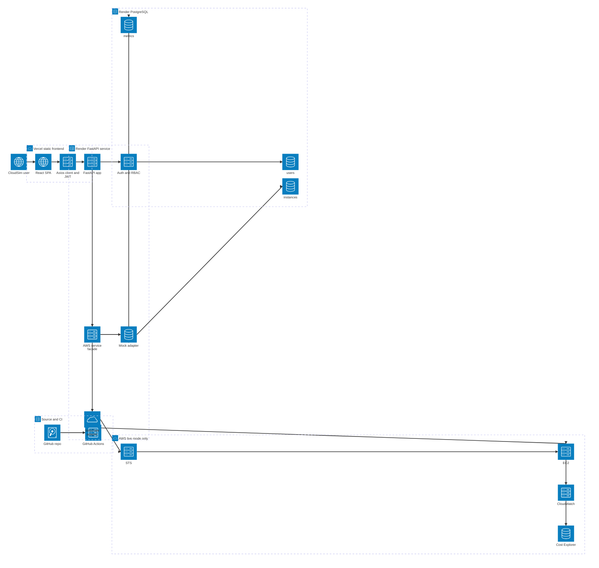
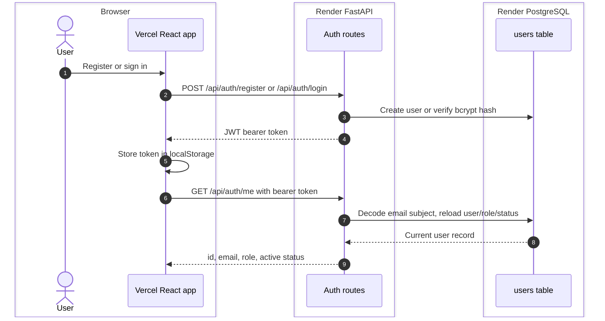
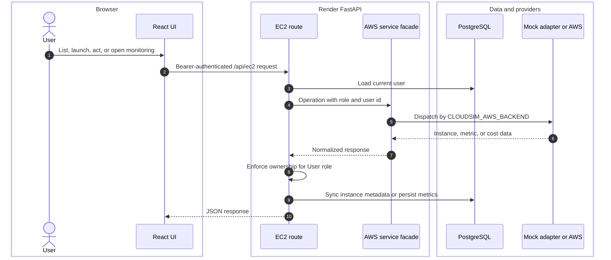

# CloudSim Production Architecture

This is the canonical architecture diagram for the final CloudSim production
app. It documents the Vercel/Render deployment, the browser-to-API boundary,
PostgreSQL responsibilities, backend-enforced RBAC, and the switchable mock/live
AWS service layer.

## System Diagram

Each group is an icon-tagged deployment boundary (`cloud` for hosted edges and
AWS, `server` for compute, `database` for stored state, `disk`/`internet` for
source and clients), and every arrow points in the direction the call actually
travels. The browser calls the Render API directly using the URL baked into the
Vite bundle as `VITE_API_URL`; Vercel serves static files and does not proxy the
API.

**Runtime flow (the numbered request path the arrows encode):**

1. The user loads the React SPA from Vercel.
2. The Axios client sends direct HTTPS requests to the FastAPI app on Render.
3. Auth routes create or verify credentials against the `users` table.
4. The RBAC guard reloads role and active status from `users` on every request.
5. Admin user-management also reads and writes `users`.
6. EC2 routes go through the AWS service facade.
7. The facade dispatches to the mock adapter when `CLOUDSIM_AWS_BACKEND=mock`.
8. The mock adapter reads and writes virtual instance state/ownership in
   `instances`, and persists generated datapoints to `metrics`.
9. The facade dispatches to the boto3 live adapter when
   `CLOUDSIM_AWS_BACKEND=live`.
10. In live mode the adapter calls EC2, CloudWatch, and Cost Explorer directly
    with the backend credential chain, or obtains role-mapped temporary clients
    through STS when `ENABLE_ROLE_BASED_ACCESS=true`. Synced live metadata lands
    in `instances` and returned metrics in `metrics`.

## Request Flows

### Authentication

The JWT contains the user's email in `sub`; it does not contain the authoritative
role. Every protected route reloads the current user from PostgreSQL, so role,
active-status, and deletion changes take effect without waiting for a new token.

### Instance And Monitoring Request

## Component Responsibilities

| Component | Responsibility |
| :--- | :--- |
| Vercel static frontend | Serves the React SPA; renders auth, dashboard, launch, details, monitoring, and IAM experiences |
| `UserContext` and Axios client | Stores the JWT, validates it through `/api/auth/me`, attaches bearer headers, and clears invalid sessions on `401` |
| Render FastAPI service | Owns API routing, request validation, CORS, security headers, health checks, startup table creation, and admin bootstrap |
| Auth and admin routes | Register/login/current-user flow and Admin-only user management |
| EC2 routes | Backend RBAC, ownership checks, normalized instance operations, metadata sync, metric persistence, and cost endpoints |
| AWS service facade | Selects mock or live behavior without changing the route contract |
| Mock adapter | Uses PostgreSQL for virtual instances and generates deterministic demo metrics and estimated costs; never calls AWS |
| Live boto3 adapter | Calls EC2, CloudWatch, and optional Cost Explorer; optionally obtains role-mapped clients through STS |
| PostgreSQL | Stores users, mock instance state/ownership, synced live instance metadata, and metric snapshots |
| GitHub Actions | Validates backend, frontend, Compose, and Docker builds; it does not define runtime request flow |

## Data Ownership

| Data | Production Source Of Truth | PostgreSQL Use |
| :--- | :--- | :--- |
| Users, roles, active status | PostgreSQL | Authoritative |
| Mock instances | PostgreSQL | Authoritative |
| Live instances | AWS EC2 | Synced summary/cache; ownership remains in AWS `CreatedBy` tags |
| CPU/network/disk metrics | Mock generator or CloudWatch | Persisted after the metrics history endpoint returns data |
| Mock costs | Calculated from visible mock instances | Instances provide calculation input |
| Live costs | Cost Explorer | Returned to the UI; not persisted |
| Dashboard alarms/zones/resource summaries | Static frontend presentation data | Not persisted |
| Memory, system logs, audit logs, advanced settings | Static/local frontend presentation data | Not persisted |

## Application Authorization

- `Admin`: all instances and admin user-management API.
- `DevOps Engineer`: all instance, metric, and cost operations; no admin API.
- `User`: can launch instances and access only owned instances, metrics, and
  scoped costs.
- Live instances carry `CreatedBy=<user_id>` and `ManagedBy=CloudSim` tags.
- Mock ownership is stored as `instances.created_by_user_id` and exposed through
  the same `CreatedBy` tag contract.
- In live mode, optional IAM role policies add a second authorization boundary.
  Effective access is the intersection of FastAPI checks and AWS IAM policy.

## Deployment And Feature Flags

| Service | Production Target | Required Configuration |
| :--- | :--- | :--- |
| Frontend | Vercel static site | Root `frontend`, build `npm run build`, output `dist`, `VITE_API_URL` |
| Backend | Render Docker web service | Root `backend`, `backend/Dockerfile`, `/health`, Render `PORT` |
| Database | Render PostgreSQL | Internal `DATABASE_URL` on the backend |

| Flag | Effect |
| :--- | :--- |
| `CLOUDSIM_AWS_BACKEND=mock` | PostgreSQL-backed demo resources; no AWS calls |
| `CLOUDSIM_AWS_BACKEND=live` | Real AWS service calls |
| `ENABLE_ROLE_BASED_ACCESS=true` | Live boto3 clients use role-mapped STS sessions |
| `ENABLE_ROLE_BASED_ACCESS=false` | Live boto3 clients use the backend credential chain |
| `ENABLE_COST_EXPLORER=true` | Enables live Cost Explorer endpoints |
| `CLOUDSIM_BOOTSTRAP_ADMIN_ENABLED=true` | Creates or restores the configured backend-only admin at startup |

Document version: 3.1
Last updated: June 22, 2026
