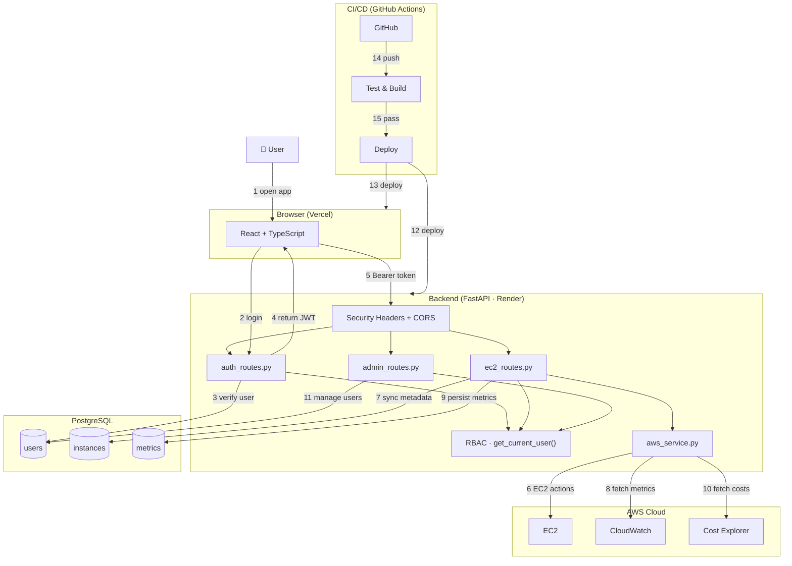

# CloudSim — Reference Architecture Diagram

> Modeled after the AWS Reference Architecture style.
> Each numbered callout corresponds to a step in the system flow described in the legend below.

---

## Architecture Diagram

---

## Flow Legend

| # | Actor / Component | Action |
|---|---|---|
| 1 | User → React App | User opens the app in a browser; React loads the Login modal |
| 2 | React App → `auth_routes` | User submits credentials via `POST /api/auth/login` |
| 3 | `auth_routes` → PostgreSQL | Backend looks up `users` table, verifies bcrypt hash |
| 4 | `auth_routes` → React App | On success, a signed JWT (HS256, 30 min TTL) is returned and stored in `localStorage` |
| 5 | React App → Security/CORS Middleware | Every subsequent API call carries `Authorization: Bearer <token>`; middleware applies security headers and CORS policy, then `get_current_user()` decodes the token and injects the current user |
| 6 | `ec2_routes` → AWS EC2 | Route handlers call `aws_service.py` (boto3 wrapper) for `describe_instances`, `run_instances`, `start_instances`, `stop_instances`, `reboot_instances`, `terminate_instances` |
| 7 | `ec2_routes` → PostgreSQL | After each AWS response, instance metadata is upserted into the local `instances` table via `sync_instances_to_db()` for fast reads and ownership tracking |
| 8 | `ec2_routes` → CloudWatch | `GET /api/ec2/instances/{id}/metrics` calls `get_metric_statistics()` for CPUUtilization, NetworkIn/Out, DiskReadOps, DiskWriteOps |
| 9 | `ec2_routes` → PostgreSQL | Each CloudWatch datapoint is persisted to the `metrics` table as a side effect (idempotent on `instance_id + metric_name + recorded_at`) |
| 10 | `ec2_routes` → Cost Explorer | `GET /api/ec2/costs/daily` and `/costs/summary` call the Cost Explorer API for daily spend and monthly projections |
| 11 | `admin_routes` → PostgreSQL | Admin-only routes create, update, and delete users directly against the `users` table; guarded by the `require_admin()` dependency |
| 12 | GitHub Actions → Backend | On push to `main`, CI runs `pytest`, then deploys updated backend to Render |
| 13 | GitHub Actions → Frontend | Same pipeline runs `npm run build`, then deploys static frontend to Vercel |
| 14 | Developer → GitHub | Developer pushes code or opens a PR; the test/build stage is triggered |
| 15 | GitHub Actions | `pytest` and `npm run build` must both pass before the deploy stage runs |

---

## Component Responsibilities

| Component | Technology | Responsibility |
|---|---|---|
| React App | React 18 · TypeScript · Vite · Tailwind · shadcn/ui | UI, routing, API client (Axios), auth state (UserContext) |
| Security Headers Middleware | Starlette `BaseHTTPMiddleware` | Adds X-Content-Type-Options, X-Frame-Options, X-XSS-Protection, Referrer-Policy, Permissions-Policy on every response |
| CORS Middleware | FastAPI `CORSMiddleware` | Restrict cross-origin requests to allowed origins (localhost dev, production domain) |
| RBAC Dependency | `get_current_user()` in `auth.py` | Decodes JWT, loads user from DB, injects `User` into protected routes |
| `auth_routes` | FastAPI router | `/register`, `/login`, `/me` |
| `ec2_routes` | FastAPI router | Full EC2 lifecycle, CloudWatch metrics, Cost Explorer endpoints — with ownership filtering for the `User` role |
| `admin_routes` | FastAPI router | User CRUD — guarded by `require_admin()` |
| `aws_service.py` | boto3 | Abstraction layer over EC2, CloudWatch, and Cost Explorer; raises `AWSConfigurationError` / `AWSServiceError` for clean API responses |
| PostgreSQL | SQLAlchemy ORM | Persists `users` (auth/RBAC), `instances` (synced AWS metadata), and `metrics` (CloudWatch snapshots) |
| GitHub Actions | CI/CD pipeline | Lint → Test → Build → Deploy on every push to `main` |

---

*Document Version: 1.1 | Last Updated: May 2026*
