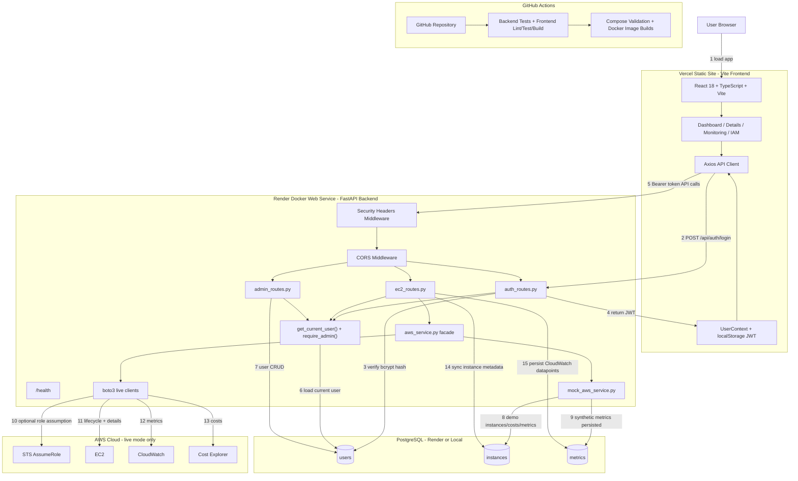

# CloudSim Reference Architecture

This diagram reflects the finished production app: a Vite React frontend, a FastAPI backend, PostgreSQL, and a switchable AWS adapter. The production hosting split is Vercel for the frontend and Render for the backend web service plus managed PostgreSQL.

## Architecture Diagram

## Flow Legend

| # | Flow | Description |
|---|---|---|
| 1 | Browser to frontend | User opens the Vercel static site. The Vite bundle was built with `VITE_API_URL` pointing at the Render backend service. |
| 2 | Login | The login form submits OAuth2 form data to `POST /api/auth/login`. |
| 3 | Credential check | FastAPI loads the user from PostgreSQL and verifies the submitted password against the bcrypt hash. |
| 4 | JWT return | The backend returns a signed bearer token. The frontend stores it in `localStorage` and validates it with `/api/auth/me`. |
| 5 | Authenticated API calls | The shared Axios client attaches `Authorization: Bearer <token>` to protected requests. |
| 6 | RBAC | `get_current_user()` validates the JWT, rejects inactive users, and gives route handlers the current user role. |
| 7 | Admin user management | Admin-only routes list, create, update, and delete users through `/api/admin/users`. |
| 8 | Mock AWS mode | `CLOUDSIM_AWS_BACKEND=mock` uses PostgreSQL-backed virtual instances and synthetic metrics/costs for safe demos. |
| 9 | Mock metric history | Synthetic metric responses are still persisted to the `metrics` table through the same route side effect. |
| 10 | Live AWS role assumption | If `ENABLE_ROLE_BASED_ACCESS=true`, the backend assumes the IAM role mapped to the CloudSim user role. |
| 11 | EC2 operations | Live mode calls EC2 for list, detail, launch, start, stop, reboot, and terminate operations. |
| 12 | CloudWatch metrics | Live mode reads CPU, network, and disk metrics through CloudWatch. |
| 13 | Cost Explorer | Live mode reads daily and monthly cost summaries when `ENABLE_COST_EXPLORER=true`. |
| 14 | Instance sync | Instance summaries are upserted into PostgreSQL for ownership and fast dashboard reads. |
| 15 | Metrics persistence | Metric datapoints are written idempotently by `instance_id + metric_name + recorded_at`. |

## Component Responsibilities

| Component | Technology | Responsibility |
|---|---|---|
| Frontend static site | React 18, TypeScript, Vite, Tailwind CSS, shadcn/ui | Authenticated shell, dashboard, launch wizard, details tabs, monitoring, IAM/settings UI |
| API client | Axios | Base URL from `VITE_API_URL`, JWT request interceptor, global 401 logout event |
| Backend service | FastAPI, Uvicorn, Docker | API routing, security headers, CORS, startup table creation, admin bootstrap |
| Authentication | bcrypt, python-jose JWT | Password hashing, login, token creation, current-user dependency |
| RBAC | FastAPI dependencies | Admin-only user management and role-aware instance visibility/action checks |
| AWS facade | `aws_service.py` | One interface for mock mode and live boto3 mode |
| Mock AWS backend | `mock_aws_service.py` | Safe production demo mode backed by PostgreSQL and synthetic metric/cost generation |
| Live AWS backend | boto3, optional STS AssumeRole | EC2 lifecycle, CloudWatch metrics, Cost Explorer summaries |
| Database | PostgreSQL, SQLAlchemy ORM | `users`, `instances`, and `metrics` tables |
| CI | GitHub Actions | Backend tests, frontend lint/test/build, Compose validation, Docker image build checks |
| Production hosting | Vercel + Render | Vercel static frontend, Render Docker backend, Render PostgreSQL, environment variables, health checks |

## Deployment Shape

| Service | Platform | Build / Runtime |
|---|---|---|
| Frontend | Vercel Static Site | Root `frontend`, build `npm run build`, output `dist` |
| Backend | Render Docker Web Service | `backend/Dockerfile`, health check `/health`, port from Render `PORT` |
| Database | Render PostgreSQL | `DATABASE_URL` set on backend service |

## Modes

| Mode | Setting | Use Case |
|---|---|---|
| Mock | `CLOUDSIM_AWS_BACKEND=mock` | Public demos, portfolio deployment, safe review environments |
| Live | `CLOUDSIM_AWS_BACKEND=live` | Real EC2, CloudWatch, and Cost Explorer integration |

Document version: 2.0
Last updated: May 2026
